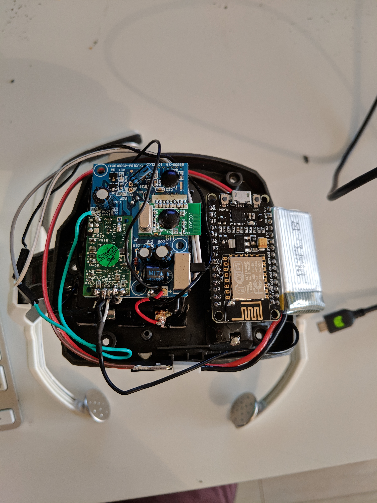
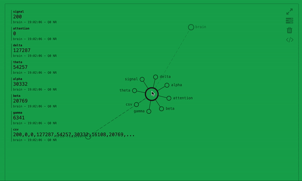

# brain-reader-esp8266-mqtt
Arduino code that will read brain activity from a NeuroSky chip to an MQTT provider creating a brain that can control the world. Essentially an Internet of Things bran.:grin:

### Build
For this project a Star Wars Force Trainer headset was used, however the hardware was replaced with an updated NeuroSky chip but the electrodes were kept.

Whatever NeuroSky chip you have solder wires to the T pin and the common ground. 
Then connect the T pin wire to the RX in on your board in this case a Nodemcu ESP8266 was used.

Below is a picture of the completed build.

A 3d printed top will be created in the coming weeks.

### Code
For this you will need the following libaries for Arduino.

[arduino-mqtt](https://github.com/256dpi/arduino-mqtt)
[Brain](https://github.com/kitschpatrol/Brain)

I used [shiftr](https://shiftr.io/) as my mqtt client. It gives a nice UI to see your messages sending.
Such as below.

